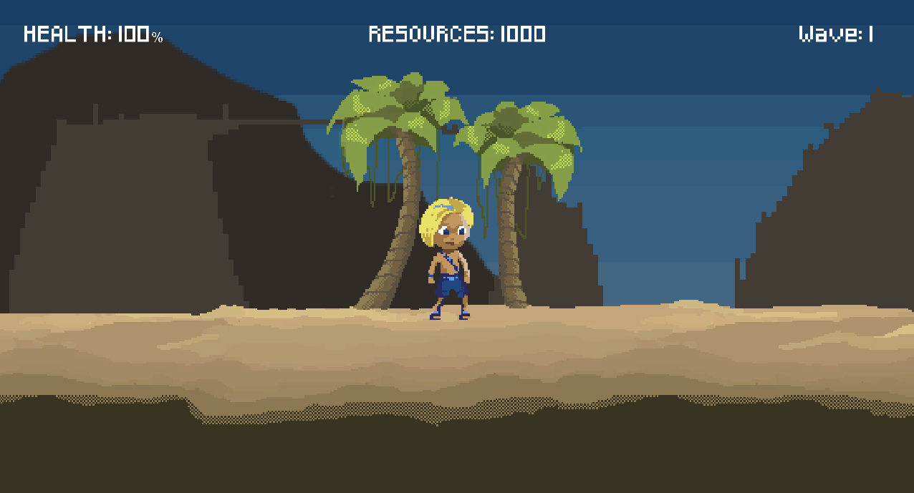
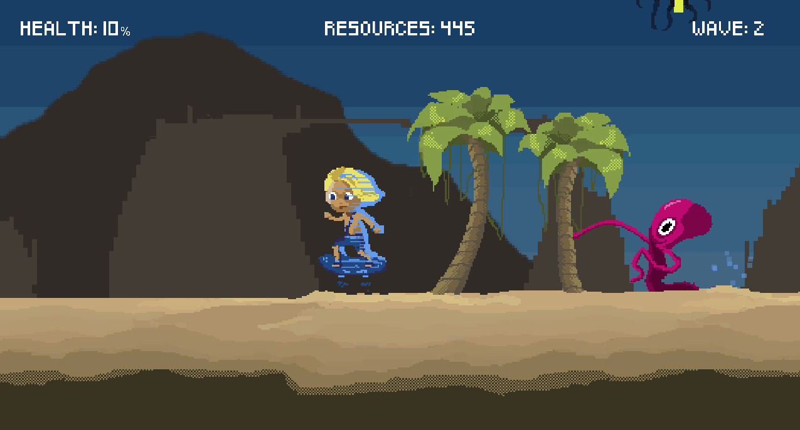
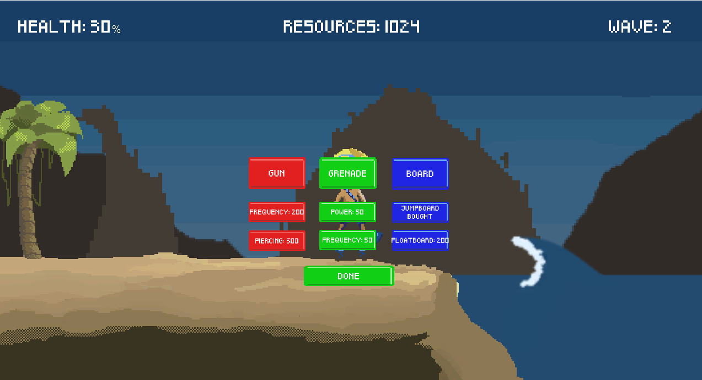
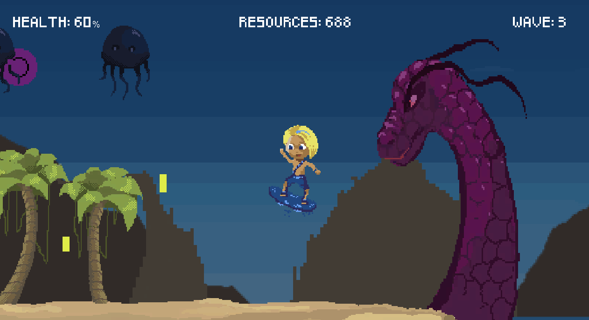
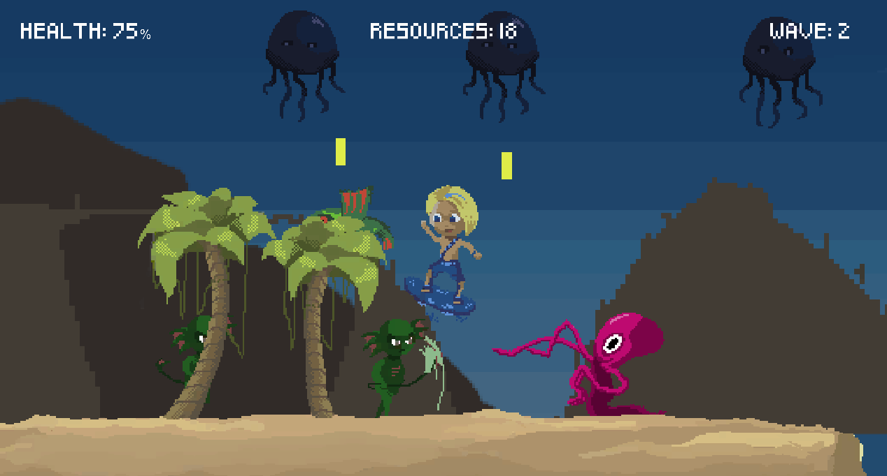

# Lemo 
This is a game made during 48h Global Game Jam 2017 in Poznań. 

We didn't implement all the features we wanted to, but despite this the game is awesome. Enjoy! 

## Control
Left/Right arrow - move 

Double left/right arrow - dash (only if jumpboard/floatboard bought)

Z - shoot

X - jump

C - grenade

## Images

## Built with
* Unity 
* C#
* Photoshop

## Authors
* Dominik Pankros - Graphics/Animations/Music
* [Piotr Ptak](https://github.com/pietersweter) - Graphics/Animations/Programming
* [Łukasz Kobyłecki](https://github.com/lukaszkobylecki) - Programming/Music

## License
This project is licensed under the MIT License.

## Contact
If you want to know more about the project, you can contact us, for example at:
* lukaszkobylecki@wp.pl
* lukkobylecki@gmail.com
* pankrosdominik@gmail.com
* robakzdobywca@gmail.com

